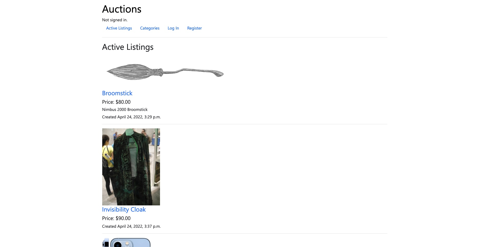
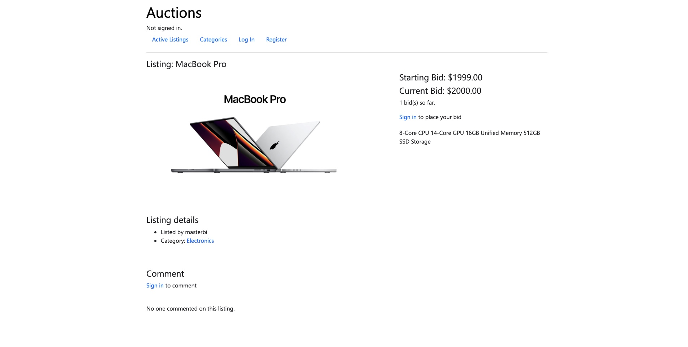
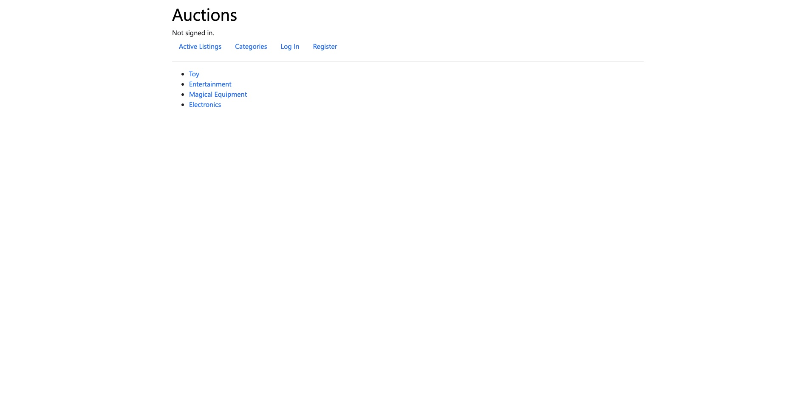
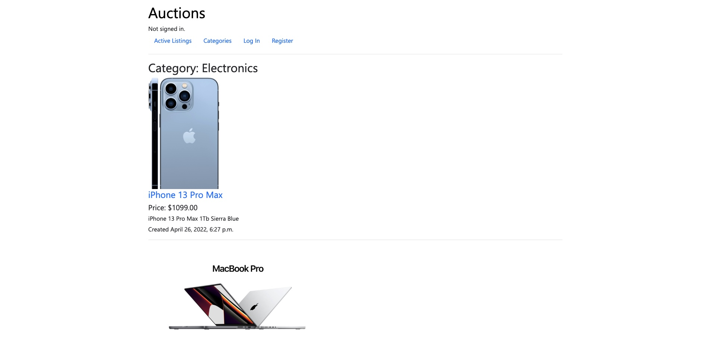
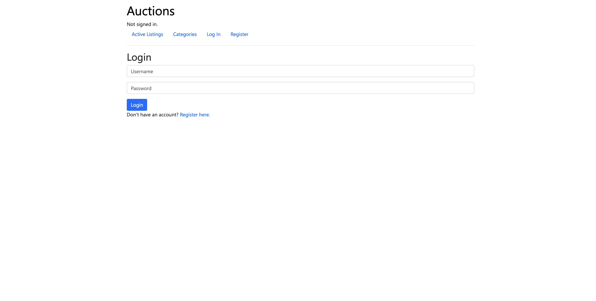
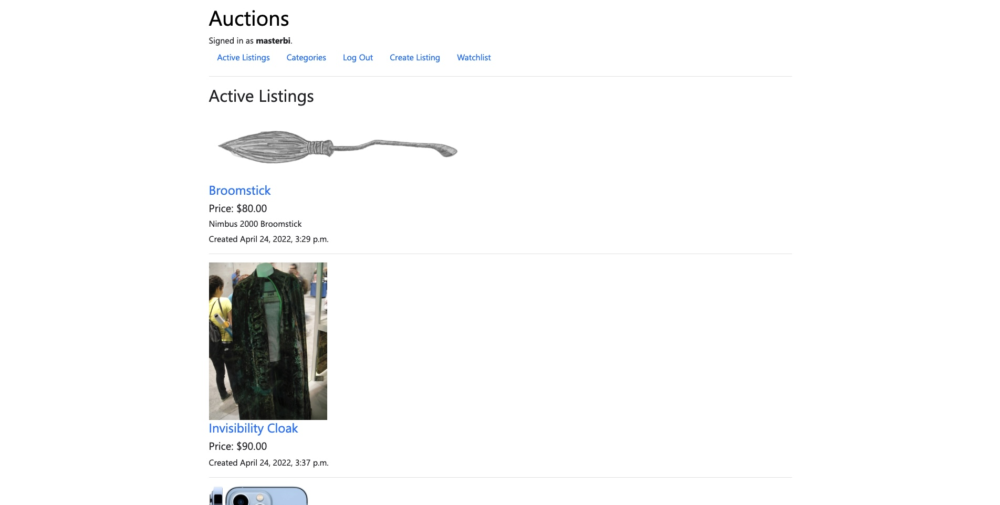
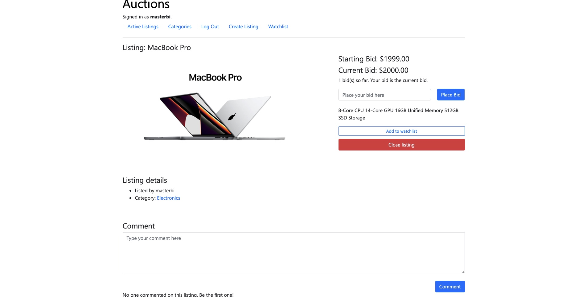
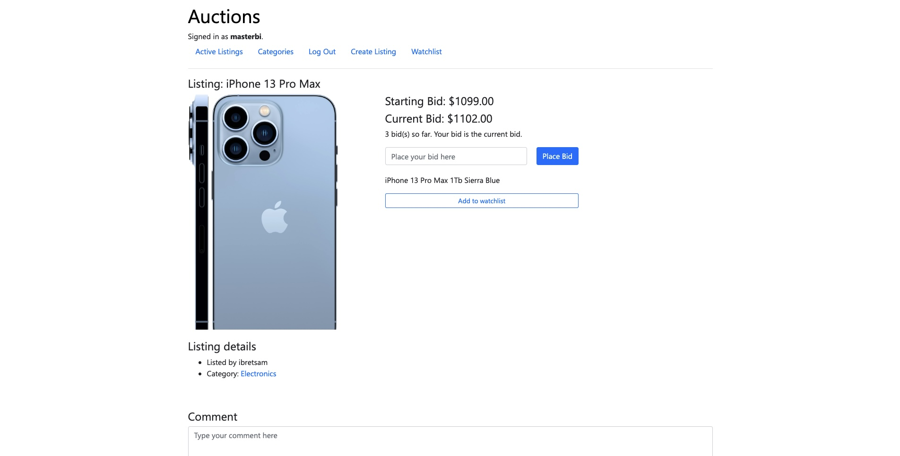
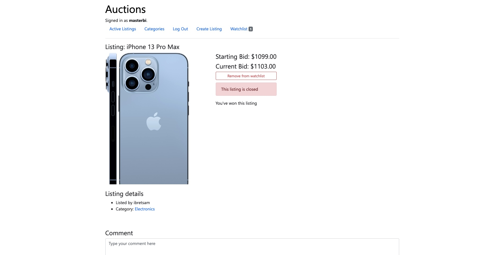

# CS50 Project 2: Commerce
3rd project from the online course [CS50's Web Programming with Python and JavaScript](https://cs50.harvard.edu/web/). Main object for this project is to design an eBay-like e-commerce auction site that will allow users to post auction listings, place bids on listings, comment on those listings, and add listings to a “watchlist”. This project uses Django as backend and HTML, CSS, Bootstrap for frontend.

See live demo here: https://auction-commerce-cs50w.herokuapp.com/

## Technologies used:
- Python:
    - Django: Uses Django as backend hosting HTML layout page as frontend.
- HTML, CSS, Bootstrap:
    - Use `HTML` to display the web and `Bootstrap` for CSS decoration.

## Project specification:
- **Models**: The application should have at least three models in addition to the User model: one for auction listings, one for bids, and one for comments made on auction listings. It’s up to you to decide what fields each model should have, and what the types of those fields should be. You may have additional models if you would like.
- **Create Listing**: Users should be able to visit a page to create a new listing. They should be able to specify a title for the listing, a text-based description, and what the starting bid should be. Users should also optionally be able to provide a URL for an image for the listing and/or a category (e.g. Fashion, Toys, Electronics, Home, etc.).
- **Active Listings Page**: The default route of your web application should let users view all of the currently active auction listings. For each active listing, this page should display (at minimum) the title, description, current price, and photo (if one exists for the listing).
- **Listing Page**: Clicking on a listing should take users to a page specific to that listing. On that page, users should be able to view all details about the listing, including the current price for the listing.
    - If the user is signed in, the user should be able to add the item to their “Watchlist.” If the item is already on the watchlist, the user should be able to remove it.
    - If the user is signed in, the user should be able to bid on the item. The bid must be at least as large as the starting bid, and must be greater than any other bids that have been placed (if any). If the bid doesn’t meet those criteria, the user should be presented with an error.
    - If the user is signed in and is the one who created the listing, the user should have the ability to “close” the auction from this page, which makes the highest bidder the winner of the auction and makes the listing no longer active.
    - If a user is signed in on a closed listing page, and the user has won that auction, the page should say so.
    - Users who are signed in should be able to add comments to the listing page. The listing page should display all comments that have been made on the listing.
- **Watchlist**: Users who are signed in should be able to visit a Watchlist page, which should display all of the listings that a user has added to their watchlist. Clicking on any of those listings should take the user to that listing’s page.
- **Categories**: Users should be able to visit a page that displays a list of all listing categories. Clicking on the name of any category should take the user to a page that displays all of the active listings in that category.
- **Django Admin Interface**: Via the Django admin interface, a site administrator should be able to view, add, edit, and delete any listings, comments, and bids made on the site.

## How to run
1. Clone this repo
```
git clone https://github.com/ibretsam/CS50Web-Project-2.git
```
2. Navigate to the project directory, create a virtual environment and activate it:
```
cd auctions

# Create a virtual environment
python3 -m venv venv

# Activate virtual environment
	# macOS:
	source venv/bin/activate
	# Windows:
	venv/Scripts/activate.bat
```
3. Install required python dependencies
```
pip install -r requirements.txt
```
4. Start the Django web server
```
python manage.py runserver
```
5. Go to the URL provided in the terminal and you should be redirected to the Homepage!

## Usage
When open the index page(`/`), you'll be direct to the home page.



This page will display all the listings by all users in the database, you can click on any listing to visit the `Listing` page, or in the navigation bar, you can visit the `Categories`, `Log in` or `Register` page.



On the `Listing` page, you can see some basic info about the listing item, like the name, image, starting bid, current bid, how many people have placed their bid, some listing detail like categories, listed by who.

There's also a `Comment` section, but you have to signed in in order to comment.

Click on the Categories link in the menu bar will direct you to the `Categories` page



This page will display all the categories in the database, you can create more on the Django Admin panel.

Click on any category will direct you to the `Category` page



This page is pretty much like the homepage, but it's only display all the products with that category.

Click on `Log In` will direct you to the `Login` page



Sign In or Register an account, then login with that account, you'll be direct to the homepage again



This time, you can see some new link on the menu bar:
- `Create Listing` will direct you to the `CreateListing` page, where you'll be create your listing.
- `Watchlist` is where you can see all the item you've added to your watchlist.

Click on a listing will direct you to the `Listing` page, there're several types of `Listing` page:

- `Your listing`: On this page, you can place bid on your listing, add to your watchlist or close the listing. And you can also comment on the listing.


- `Other people listing`: On this page, you can place your bid, add to watchlist and make comment. When the owner of the listing closed the list, the person who place the `Current Bid` will won the listing.


- `Won Listing`: On this page, you can only add or remove from your watchlist and make comment. No one else can place bid on this listing, other people only see it as a `Closed listing`

That's all for the project, thank you for reading!